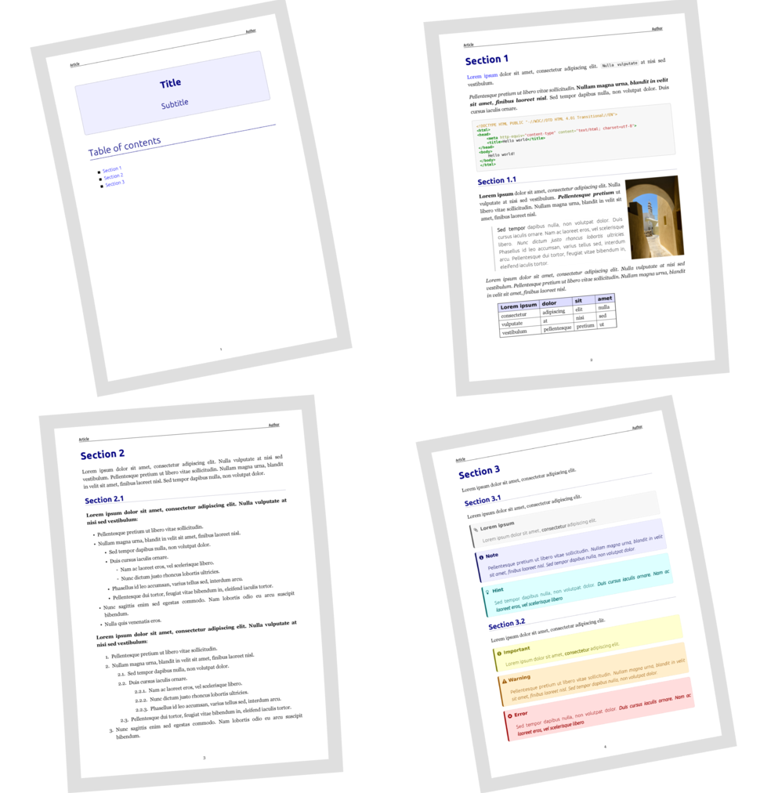
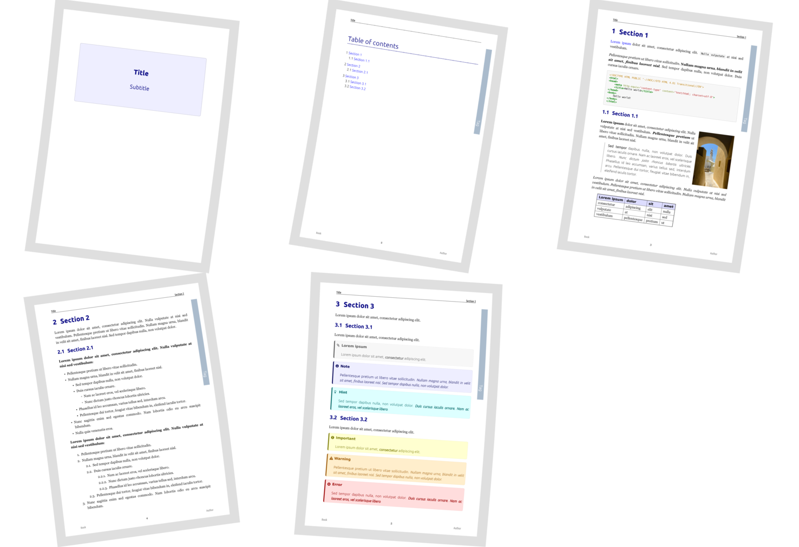
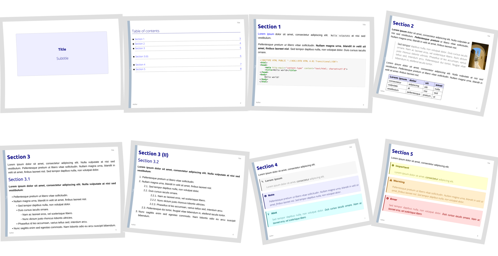

# markdown-template

Template to compose books, slides and articles in Markdown and export them to PDF, ODT and HTML.

## Requirements

- **Ubuntu** 18.04 or other compatible Linux distribution.
- **Python** 3 or later.
- Several Python packages:
	- **markdown**, to support markdown conversion to HTML.
	- **pygments**, as syntax highlighter.
	- **weasyprint**, to convert from HTML to PDF.
- **LibreOffice**, to support ODT conversion.
- **Font Awesome** TTF font, to support admonition icons.
- **make** utility to build target formats from Markdown.

## Installation of utilities

Install some Python utilities along with some libraries and other stuff:

~~~
sudo apt install build-essential python3-dev python3-pip python3-cffi
sudo apt install libcairo2 libpango-1.0-0 libpangocairo-1.0.0 libgdk-pixbuf2.0-0 libffi-dev
sudo apt install shared-mime-info
sudo apt install make
~~~

Use `pip3` to install Python packages:

~~~
sudo -H pip3 install markdown
sudo -H pip3 install pygments
sudo -H pip3 install weasyprint
sudo -H pip3 install --upgrade six
~~~

Install [Font Awesome](http://fontawesome.io/) TTF font and check correct installation:

~~~
sudo apt install fonts-font-awesome
fc-list | grep awesome
~~~

Additionaly, to support admonition icons in HTML output format, you will need to place the following files inside `css/web/font-awesome/fonts/`:

- FontAwesome.otf
- fontawesome-webfont.eot
- fontawesome-webfont.svg
- fontawesome-webfont.ttf
- fontawesome-webfont.woff
- fontawesome-webfont.woff2

Optionally, you can install an easy to use Markdown editor like [ReText](https://github.com/retext-project/retext), from Ubuntu repositories:

~~~
sudo apt install retext
~~~

Or you can install the latest version using `pip3`:

~~~
sudo -H pip3 install retext
~~~

## Basic usage

The template contains the following types of **basic documents**:

- **Article**, for simple compositions.
- **Document**, for more complex and structured stuff like books.
- **Keynotes**, for slides.

Each kind of document consists of two main files: a **markdown** (`.md`) file and a **stylesheet** (`.css`) file. If you are writing a book, for example, you will be using `document.md` and `document.css` as a starting point:

- `document.md` will be used to write all the contents of your book.
- `document.css` can be used to customize the default CSS style by overriding some rules.

To export your Markdown to PDF, HTML and ODT, use the `make` utility:

~~~
make
~~~

The output will be placed inside `html`, `odt` and `pdf` directories.

You don't have to obey the default filenames. For example, you can rename `document.md` to `mybook.md` and use the utility script `generate-makefile.sh` to automatically update the `Makefile`. In that case, you will have to name the stylesheet `mybook.css`, just like the Markdown file. That's the only restriction.

## Output Samples in PDF format

### Article style

### Document style

### Keynotes style

